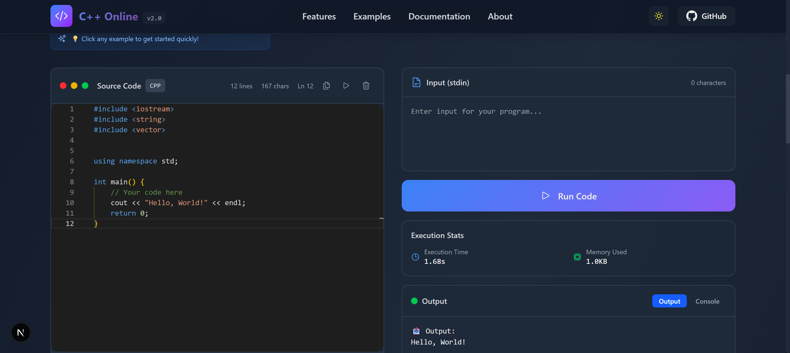

# Online Code Compiler - Premium Edition


> A next-generation, premium web-based code compiler and IDE with a sleek, developer-centric interface inspired by VS Code, Replit, and modern SaaS dashboards. Write, compile, and run code in multiple languages instantly in your browser.

## 🖼️ Demo



## ✨ Key Features

### 🎨 Premium UI/UX Design
- **Dark/Light Theme**: Seamless theme switching with neon blue/purple accents
- **Glassmorphism Effects**: Modern frosted glass panels with backdrop blur
- **Neon Glow Effects**: Beautiful neon accents and glowing elements
- **3D Floating Elements**: Holographic accents and cinematic lighting
- **Responsive Design**: Optimized for desktop, tablet, and mobile devices

### 💻 Advanced Code Editor
- **Monaco Editor Integration**: Industry-standard code editor with full feature set
- **Minimap**: Visual code overview for easy navigation
- **Tab Support**: Multiple file tabs for better code organization
- **Custom Themes**: Premium dark/light themes with neon accents
- **Syntax Highlighting**: Full support for all languages
- **Auto-completion**: Intelligent code suggestions and snippets
- **Bracket Pair Colorization**: Enhanced code readability
- **Glowing Cursor**: Premium cursor effects

### 🛠️ Developer Tools
- **Command Palette** (Ctrl+K): Quick access to all commands
- **Resizable Panels**: VS Code-style draggable split panes
- **File Explorer**: Optional sidebar with file tree and operations
- **Diagnostics Panel**: Real-time error highlighting and suggestions
- **Execution Stats**: Runtime, memory, and CPU usage metrics
- **Modern Toolbar**: Quick actions for Run, Format, Save, Share, Reset

### 🌐 Multi-Language Support
- **C++** (GCC 9.2.0)
- **C** (GCC 9.2.0)
- **Java** (OpenJDK 13.0.1)
- **Python** (3.8.1)
- **JavaScript** (Node.js 12.14.0)
- **C#** (Mono 6.6.0.161)
- **Go** (1.13.5) ✨ New
- **Rust** (1.40.0) ✨ New
- **SQL** (SQLite 3.27.2)

### ⚡ Enhanced Features
- **Quick Actions**: Templates dropdown with code snippets
- **Keyboard Shortcuts**: Full keyboard navigation support
- **Collapsible Panels**: Input/Output sections with smooth animations
- **Real-time Streaming**: Live output and console logs
- **Error Highlighting**: Inline error markers and diagnostics
- **Loading Animations**: Premium shimmer loaders and spinners
- **Language Icons**: Beautiful SVG icons for each language

## 🚀 Getting Started

### Prerequisites
- Node.js 18+ and npm/yarn
- A Judge0 API key (from RapidAPI)

### Installation

1. **Clone the repository**
```bash
git clone https://github.com/kenilGamer/cpp-compiler
cd cpp-compiler
```

2. **Install dependencies**
```bash
npm install
```

3. **Set up environment variables**
Create a `.env.local` file in the root:
```env
NEXT_PUBLIC_JUDGE0_API_KEY=your_rapidapi_key_here
NEXT_PUBLIC_JUDGE0_API_HOST=judge0-ce.p.rapidapi.com
```

4. **Run the development server**
```bash
npm run dev
```

Visit [http://localhost:3000](http://localhost:3000) in your browser.

## 📖 Usage

### Basic Workflow
1. Select your programming language from the dropdown
2. Write or paste your code in the Monaco editor
3. Provide input (stdin) if needed in the Input panel
4. Click **Run Code** or press `Ctrl+Enter`
5. View output, errors, and execution stats in real-time

### Keyboard Shortcuts
- `Ctrl+K` / `Cmd+K`: Open command palette
- `Ctrl+Enter`: Run code
- `Shift+Alt+F`: Format code
- `Ctrl+S`: Save code
- `Ctrl+Shift+S`: Share code
- `Ctrl+R`: Reset/clear code

### Advanced Features
- **Command Palette**: Press `Ctrl+K` to access all commands quickly
- **Resizable Panels**: Drag the divider between panels to resize
- **Tabs**: Click the `+` button to create new file tabs
- **Theme Toggle**: Use the theme toggle button in the toolbar
- **Quick Templates**: Click the Templates button for code snippets
- **Diagnostics**: View errors and warnings in the diagnostics panel

## 🏗️ Project Structure

```
app/
├── components/
│   ├── CodeEditor.js          # Monaco editor with tabs and minimap
│   ├── InputOutput.js         # Enhanced I/O panel with collapsible sections
│   ├── Toolbar/
│   │   └── ModernToolbar.js   # Premium toolbar with actions
│   ├── Panels/
│   │   └── ResizablePanels.js # VS Code-style resizable panels
│   ├── CommandPalette/
│   │   └── CommandPalette.js  # Command palette (Ctrl+K)
│   ├── Sidebar/
│   │   └── FileExplorer.js    # File explorer sidebar
│   ├── Diagnostics/
│   │   └── DiagnosticsPanel.js # Error highlighting panel
│   ├── Stats/
│   │   └── ExecutionStats.js  # Runtime stats display
│   ├── Loading/
│   │   ├── LoadingSpinner.js  # Premium loading animations
│   │   └── ShimmerLoader.js   # Shimmer skeleton loaders
│   ├── LanguageIcons/
│   │   └── LanguageIcon.js    # Language-specific icons
│   └── ThemeToggle.js         # Theme switcher
├── contexts/
│   └── ThemeContext.js        # Theme management context
├── hooks/
│   └── useCommandPalette.js   # Command palette hook
├── utils/
│   ├── constants.js           # Language definitions and examples
│   └── api.js                 # Judge0 API integration
└── globals.css                # Premium design system styles
```

## 🎨 Design System

### Color Palette
- **Primary**: Neon Blue (`#3b82f6`) to Purple (`#8b5cf6`) gradients
- **Accent**: Cyan (`#06b6d4`) and Purple (`#a855f7`)
- **Background**: Deep dark grays with subtle gradients
- **Neon Effects**: Blue/purple glow effects throughout

### Typography
- **Sans**: Inter, SF Pro Display, system fonts
- **Mono**: JetBrains Mono, Fira Code, Cascadia Code

### Components
- **Glassmorphism**: Frosted glass panels with backdrop blur
- **Neon Glow**: Subtle glow effects on interactive elements
- **Smooth Animations**: Cubic-bezier transitions
- **Rounded Corners**: Consistent border-radius system

## ⚙️ Customization

### Adding New Languages
Edit `app/utils/constants.js`:
```javascript
export const languages = [
  { id: "XX", name: "Language Name", version: "X.X.X" },
  // ...
];

export const languageMap = {
  "XX": "language-id",
  // ...
};
```

### Customizing Themes
Edit `app/globals.css` to modify CSS variables:
```css
:root {
  --primary: #3b82f6;
  --accent: #8b5cf6;
  /* ... */
}
```

### Adding Code Templates
Edit `app/components/QuickActions.js` to add new templates for each language.

## 🛠️ Tech Stack

- **Framework**: Next.js 16 (App Router)
- **UI**: React 19
- **Editor**: Monaco Editor (VS Code editor)
- **Styling**: Tailwind CSS 4
- **Icons**: Heroicons
- **API**: Judge0 (via RapidAPI)
- **Fonts**: Inter, JetBrains Mono

## 🤝 Contributing

Contributions are welcome! Please follow these steps:

1. Fork the repository
2. Create your feature branch (`git checkout -b feature/amazing-feature`)
3. Commit your changes (`git commit -m 'Add amazing feature'`)
4. Push to the branch (`git push origin feature/amazing-feature`)
5. Open a Pull Request

### Development Guidelines
- Follow the existing code style
- Add comments for complex logic
- Test your changes thoroughly
- Update documentation as needed

## 📝 License

This project is licensed under the MIT License - see the [LICENSE](LICENSE) file for details.

## 🙏 Acknowledgments

- [Monaco Editor](https://microsoft.github.io/monaco-editor/) - Code editor
- [Judge0](https://judge0.com/) - Code execution API
- [Heroicons](https://heroicons.com/) - Beautiful icons
- [Next.js](https://nextjs.org/) - React framework

---


